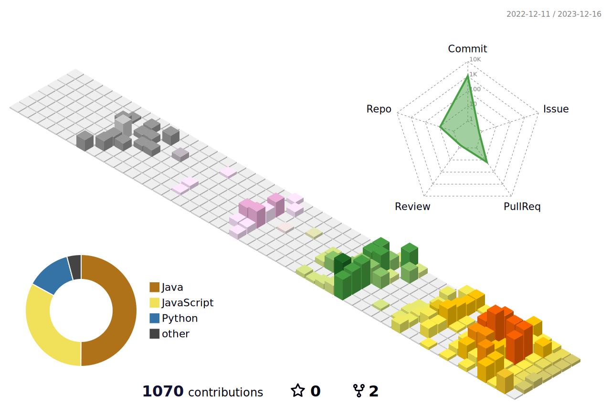

 안녕하세요. 연주원입니다.

###  Time Line

`2023.01.` - `2023.12.` 삼성 청년 SW 아카데미 9기  
`2021.12.` - `2022.06.` KDT 지능형 웹 서비스 풀스택 개발 과정  
`2020.03.` - `2022.02.` 덕성여자대학교 컴퓨터공학과  
`2017.03.` - `2020.02.` 명지전문대학 컴퓨터공학과  

###  Skills 

  
  
  

  
  

###  Algorithm Problem Solving

<!--
### Hi there 👋

**joo1yeon/joo1yeon** is a ✨ _special_ ✨ repository because its `README.md` (this file) appears on your GitHub profile.

Here are some ideas to get you started:

- 🔭 I’m currently working on ...
- 🌱 I’m currently learning ...
- 👯 I’m looking to collaborate on ...
- 🤔 I’m looking for help with ...
- 💬 Ask me about ...
- 📫 How to reach me: ...
- 😄 Pronouns: ...
- ⚡ Fun fact: ...
-->
